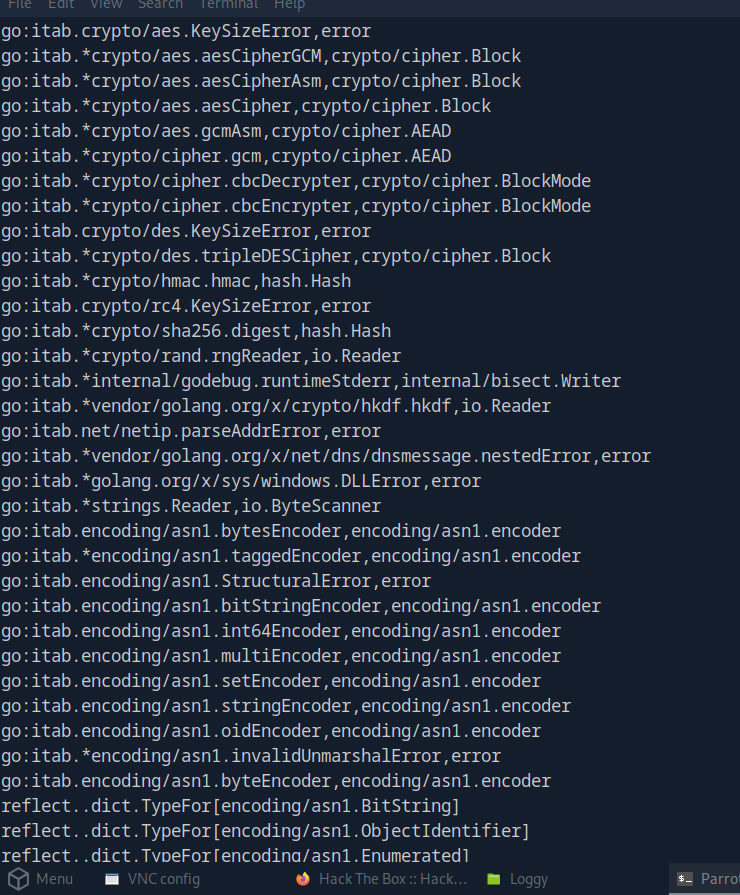
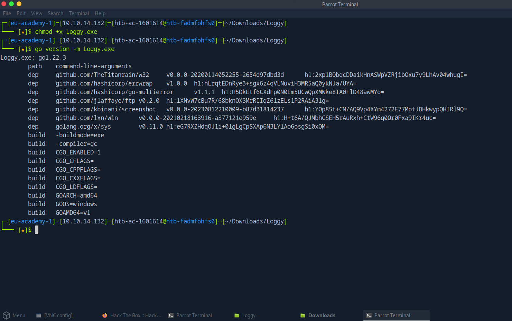
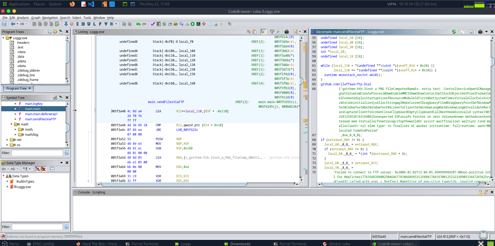
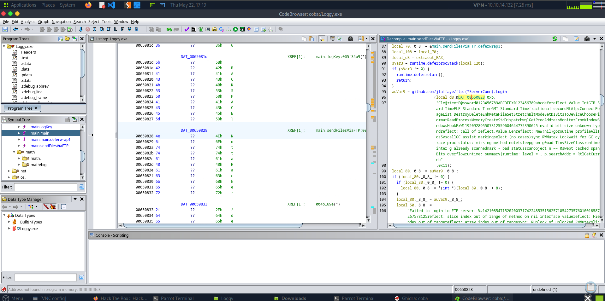
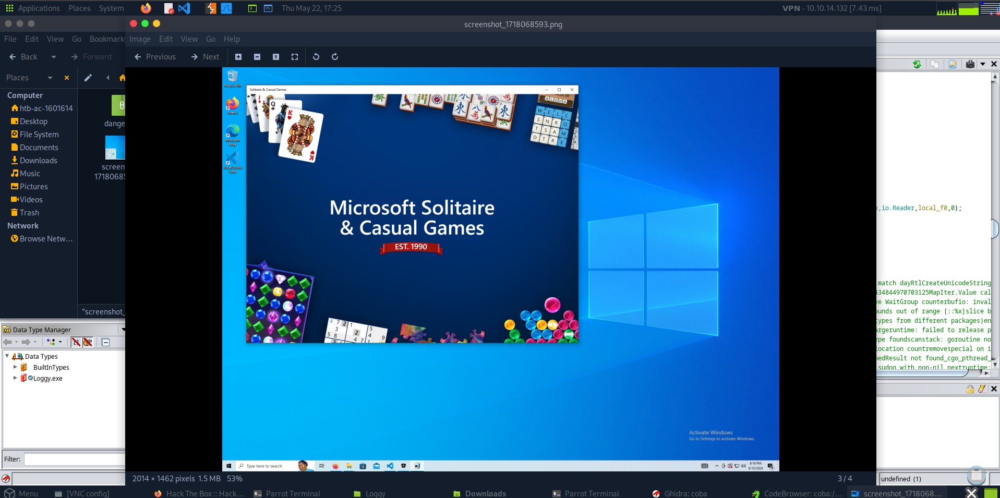

# Loggy
### 1. What is the SHA-256 hash of this malware binary?
I use this command:
```bash
sha256sum Loggy.exe
```

### 2. What programming language (and version) is this malware written in?
for every challenge, i always check for the strings.
```
strings Loggy.exe
```
then i got:

and all other stuffs indicating that it's written in go.

for the version, there are 2 ways that i utilized:
##### 1. go version is usually written in this format:
```
go1.23.5
```

so the grep would be:
```
strings Loggy.exe | grep "go1"
```

##### 2. i made it executable first for go runtime to analyze it better:
```bash
chmod +x Loggy.exe
```

then i can extract all useful information by this command
```go
go version -m Loggy.exe
```


#### 3. There are multiple GitHub repos referenced in the static strings. Which GitHub repo would be most likely suggest the ability of this malware to exfiltrate data

the only possible dependency to exfiltrate data from the attached image is ftp

#### 4. What dependency, expressed as a GitHub repo, supports Janice’s assertion that she thought she downloaded something that can just take screenshots?

we can extract it from the image above

#### 5. Which function call suggests that the malware produces a file after execution?
let's analyze it with ghidra.
#### 6. You observe that the malware is exfiltrating data over FTP. What is the domain it is exfiltrating data to?
from the official docs of ftp, we can connect to ftp address using dial like this :
```go
func Dial(addr string, options ...DialOption) (*ServerConn, error)
```
and after analyzing the main function, I got this

string in go is defined like this:
```go
type stringHeader struct {
    Data uintptr  // pointer to data
    Len  int      // length of the string
}
```
which is the first argument with only first 14 character, since the second argument should be the length of it without the port of 21
#### 7. What are the threat actor’s credentials?
still in the same function of main.sendFilesViaFTP().
from the official docs of FTP, we login to ftp with this function:
```go
func (c *ServerConn) Login(user, password string) error
```

we implement the same concept, so &DAT_00650828 would be the user and the 17 (0x11) first character of the fourth argument would be the password

#### 8. What file keeps getting written to disk?

#### 9. When Janice changed her password, this was captured in a file. What is Janice's username and password?
we should analyze the keylog.txt file manually or using script.
#### 10. What app did Janice have open the last time she ran the "screenshot app"?
we can get it from the extracted file which is the game solitaire



