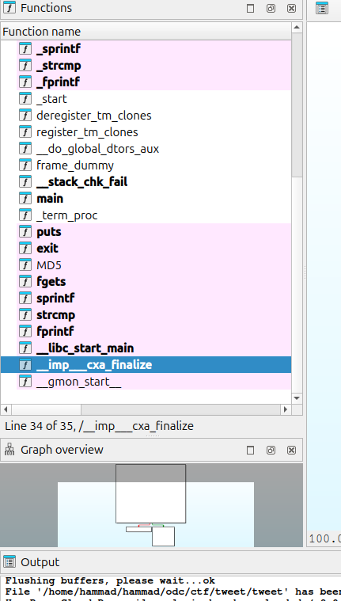

# Tweet

it looked annoying in the beginning because there is no function just like usual program. even when i tried reverse with ghidra, there is nothing, literally nothing. but then, in ida there is some arrays elon_musk_tweet, bird, and message
1. copy all the content of elon_musk_tweet 
2. there is md5 function in ida. and the chalenge's clue is to use openssl. maybe that is the type of hash that is used to hash the tweet 
3. i tried this site https://crackstation.net/ and copy all the elon_musk_tweet content
4. i only got "flag{", so the content must be the flag. the other content failed to reverse with this site
5. craft a script to hash md5 in python. 
6. because it's hash not encryption, so i have to match the result of the hash of each possible "flagset" variable with the hashed tweet
7. if equals, then that is the next candidate from the flagset.
8. got this flag{aHR0cHM6Ly93d3cueW91dHViZS5jb20vd2F0Y2g/dj13bV9nb3E5QllWcw==}
turned out that msg and bird arrays aren't used